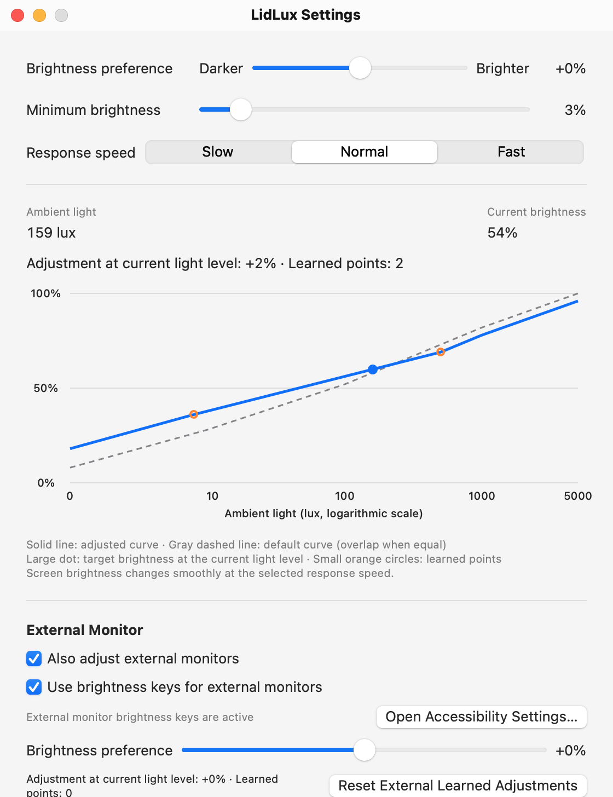

# LidLux

[English](README.md) | [한국어](README.ko.md)

[](https://github.com/n3wr1ch/lidlux/actions/workflows/ci.yml)

**Ambient light–based brightness control for your MacBook and external monitors.**

When macOS automatic brightness stops working after you connect an external monitor, LidLux reads the MacBook’s built-in ambient light sensor directly and adjusts the built-in display and DDC/CI-compatible external monitors from the menu bar.

<picture>
  <source media="(prefers-color-scheme: dark)" srcset="docs/images/settings-dark.png">
  <source media="(prefers-color-scheme: light)" srcset="docs/images/settings-light.png">
  
</picture>

## Features

- **Automatic brightness:** a logarithmic light curve with smoothing and gradual brightness transitions. Built-in and external automatic control can be enabled independently.
- **Learning by light level:** adjust brightness with the brightness keys or your monitor’s buttons while automatic control is on. LidLux remembers detected adjustments around that light level, keeping up to **8 points per curve** and interpolating brightness between them. The learned curve keeps target brightness from decreasing as ambient light increases. Built-in and external learning are separate; external monitors share one learned curve.
- **DDC/CI control:** adjust the hardware brightness of compatible external monitors.
- **Brightness keys and HUD:** control the external screen under the pointer and see an on-screen brightness indicator after a successful write.
- **Idle dimming awareness:** built-in display dimming while you are away is not learned as a preference or immediately undone.
- **Clamshell pause:** automatic adjustment pauses for both built-in and external displays when the lid is closed and the built-in display is inactive.
- **English and Korean UI:** Korean when the first preferred system language is Korean; English otherwise.

## Requirements

- An **Apple Silicon MacBook** with a built-in ambient light sensor.
- **macOS 13 or later.** Compatibility depends on private APIs; see [Limitations](#limitations).
- For external control, a **DDC/CI-compatible monitor** with DDC/CI enabled in its on-screen menu (OSD). Support varies by monitor, cable, and dock; **HDMI may not work on some models**.

## Install

### Homebrew

```sh
brew install --cask n3wr1ch/tap/lidlux
```

Upgrade with `brew upgrade --cask lidlux`. The first-launch and Accessibility notes below still apply.

### Download a release

1. Download the LidLux ZIP from [GitHub Releases](https://github.com/n3wr1ch/lidlux/releases) and unzip it.
2. Move `LidLux.app` to `/Applications` and open it.
3. If macOS blocks the first launch, go to **System Settings → Privacy & Security → Open Anyway** and confirm.

LidLux is ad-hoc signed, **not Developer ID signed or notarized**. Alternatively, after downloading from this repository and verifying the release checksum, remove the quarantine attribute and open the app again:

```sh
xattr -dr com.apple.quarantine /Applications/LidLux.app
```

The release notes include checksum verification instructions.

### Build from source

Install Apple’s Command Line Tools; the full Xcode app is not required. From the repository directory, run:

```sh
./build.sh install
```

This builds and ad-hoc signs the app, replaces `/Applications/LidLux.app`, and launches it. An existing LidLux process is stopped first. To build without installing or launching, run `./build.sh`; the result is `build/LidLux.app`.

## Usage

Click the sun icon in the menu bar. Built-in automatic control, external automatic control, and external brightness keys are enabled by default.

**Recommended:** turn off **System Settings → Displays → Automatically adjust brightness** for the built-in display. Otherwise, macOS and LidLux can compete, and system changes may be learned as your preferences.

Avoid running LidLux alongside **Lunar or MonitorControl**. LidLux shows a conflict warning in the menu and settings when either app is running. Quit the other app or disable its brightness control; its changes may otherwise be learned as manual adjustments.

### Menu

| Item | Purpose |
| --- | --- |
| Ambient light / Brightness | Current sensor reading and built-in display brightness |
| Adjustment / Learned points | Learned adjustment at the current light level and point count |
| Brightness preference | Make the built-in curve darker or brighter |
| Automatically adjust brightness | Toggle built-in automatic control |
| Also adjust external monitors | Toggle external automatic control; monitor status and conflict warnings appear below |
| Use brightness keys for external monitors | Toggle external keyboard control and check its status |
| Open Accessibility Settings… | Grant keyboard-control permission; shown when permission is missing |
| Reset Learned Adjustments | Clear built-in learned points |
| Settings… (⌘,) | Open brightness settings and curve previews |
| Launch at Login | Enable or disable startup at login |
| Quit LidLux | Quit the app |

### Settings

- **Brightness preference:** −30% to +30%, default 0, for built-in and external displays separately. This is an additive curve adjustment.
- **Minimum brightness:** 0–30%, default 3%, for the built-in display.
- **Response speed:** Slow, Normal, or Fast; default Normal.
- **Live status and graphs:** ambient light, current brightness, learned adjustments, and default/adjusted curves with learned points.
- **External Monitor:** automatic control, brightness keys, Accessibility settings, brightness preference, learned-point reset, monitor brightness, and conflict warnings. External brightness reflects the last read or successful write, so monitor-button changes appear on a later read.
- **Reset Learned Adjustments / Restore Defaults:** clear built-in learning, or restore brightness settings and both learned curves. Restore Defaults also enables automatic control and external brightness keys; it preserves Launch at Login.

Settings and learned points are saved automatically.

### Brightness keys

Allow LidLux in **System Settings → Privacy & Security → Accessibility**. You can open that pane from LidLux’s menu or settings. Permission is checked periodically, so a restart is not normally needed after granting it.

Place the pointer on an external screen and press the brightness keys (usually F1/F2). Hold **Fn** as well if your keyboard uses standard function keys. Each press changes brightness by **1/16 of the monitor’s maximum (6.25%)**; **Option+Shift** uses **1/64 (about 1.56%)**, rounded to the monitor’s integer units. A successful adjustment shows a HUD on that screen.

With the pointer on the built-in screen, the keys retain their normal macOS behavior. External key control also works with external automatic control disabled, but learning requires automatic control to be on. Monitor selection has [name-matching limitations](#limitations).

## How it works

```text
Built-in ambient light sensor → log10(lux + 1) → smoothing
  → base curve + brightness preference + learned adjustment
  → built-in display (DisplayServices) / external monitors (DDC via IOAVService)
```

LidLux samples the sensor every **0.5 seconds**, responds faster to increasing light than decreasing light, and moves brightness gradually toward the target. Detected manual adjustments become learned points; nearby points are replaced, and the oldest point is removed when the curve exceeds eight points. Brightness is interpolated between points, with the nearest point’s adjustment used outside the learned range.

The sensor uses **IOHIDEventSystem**, built-in brightness uses **DisplayServices**, and external DDC/CI uses **IOAVService**. These are private APIs.

## Limitations

- Private APIs can break with macOS updates. Compatibility with every Mac, monitor, or OS version is not guaranteed. If the sensor or required built-in API cannot be initialized, LidLux shows an alert and exits.
- Updates or rebuilds change the ad-hoc signature and may require granting Accessibility permission again. Remove the old LidLux entry from the Accessibility list, then add the updated `/Applications/LidLux.app`.
- With multiple external monitors, matching DDC services to screen names can be ambiguous. Keyboard control adjusts matching names; if no name matches, it falls back to **all detected external monitors**. Identical names can also select multiple monitors. The HUD then reflects the last successful write.
- Learning infers manual changes from brightness readings; built-in learning also checks recent user activity. Other brightness tools can therefore affect learned preferences. External button changes are learned on a later DDC read, not immediately.
- Closing the lid pauses automatic adjustment because the sensor is covered. LidLux does not provide ambient light–based automatic control in clamshell mode.

## Troubleshooting

### View logs

```sh
/usr/bin/log show --last 1h --predicate 'subsystem == "com.ntoktok.lidlux"'
```

Use the full **`/usr/bin/log`** path: zsh’s `log` builtin conflicts with the macOS logging command.

### External monitor is not detected or brightness is unavailable

Enable **DDC/CI** in the monitor’s OSD. Check the cable, adapter, or dock; try a direct connection or another connection type if available, especially with HDMI. Reconnect the monitor to trigger discovery again. Check LidLux’s monitor status and logs for DDC errors, and quit other brightness-control apps.

### Brightness keys do not work

Enable **Use brightness keys for external monitors**, place the pointer on an external screen, and confirm that LidLux can read its brightness. Check **Accessibility** permission and use **Fn** if needed. If permission is already enabled after an update or rebuild, remove LidLux from the permission list and add the current app again.

## Development

The project uses Swift Package Manager, AppKit, and SwiftUI.

```text
Sources/LidLux/
  main.swift                          Menu bar, launch at login, system events
  BrightnessController.swift          Sensor sampling, built-in control and learning
  ExternalDisplays.swift              Serial DDC/CI discovery, reads, and writes
  ExternalBrightnessController.swift  External control, learning, conflict detection
  LearnedCurve.swift                  Learned points and brightness interpolation
  BrightnessKeyTap.swift              Key capture, Accessibility, screen selection
  BrightnessHUD.swift                 External brightness overlay
  Settings.swift                      Persistent settings and applied curves
  SettingsWindow.swift                Settings UI, menu slider, curve previews
  Localization.swift                  English and Korean UI strings
  PrivateAPI.swift                    Sensor and built-in display API wrappers
Tests/LidLuxTests/                     Learned-curve and localization tests
Package.swift                         Swift package and minimum macOS version
build.sh                              App bundle, signing, optional install or ZIP
scripts/test.sh                       Tests with Command Line Tools or Xcode
scripts/make-icon.swift               Icon artwork
scripts/make-icon.sh                  Icon size conversion and ICNS packaging
Resources/AppIcon.icns                 Bundled app icon
```

Run tests without launching the app:

```sh
./scripts/test.sh
```

[CI](https://github.com/n3wr1ch/lidlux/actions/workflows/ci.yml) runs tests, builds the app, and checks the bundle metadata, executable, icon, and signature on `macos-15` for pushes to `main` and pull requests. See [RELEASING.md](RELEASING.md) for the tag-based release process and ZIP/checksum assets.

After changing the icon artwork, regenerate it and rebuild:

```sh
./scripts/make-icon.sh
./build.sh
```

## License

[MIT](LICENSE).
